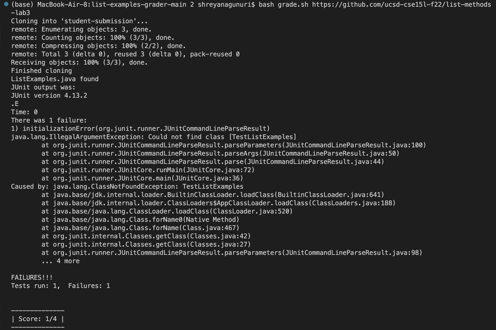
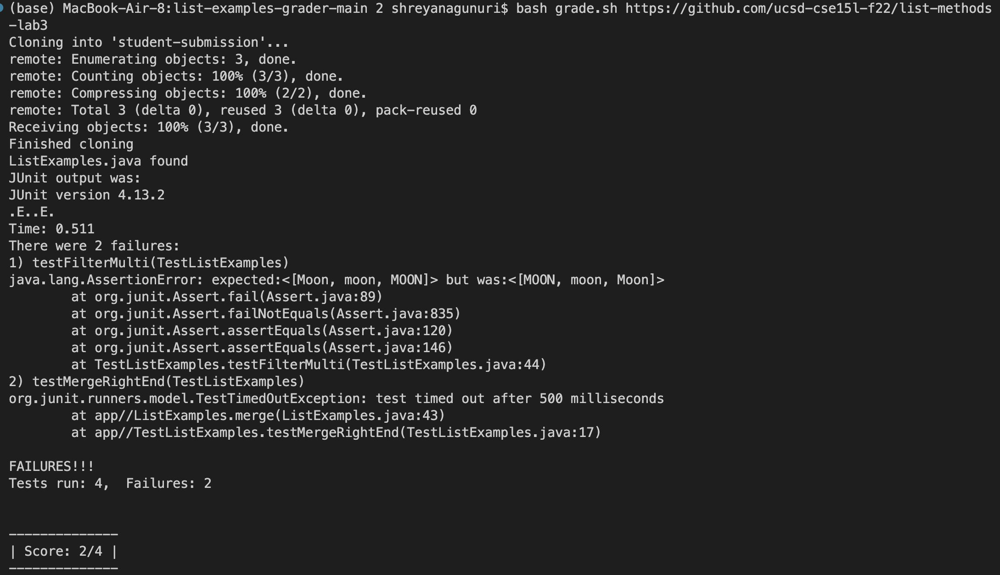
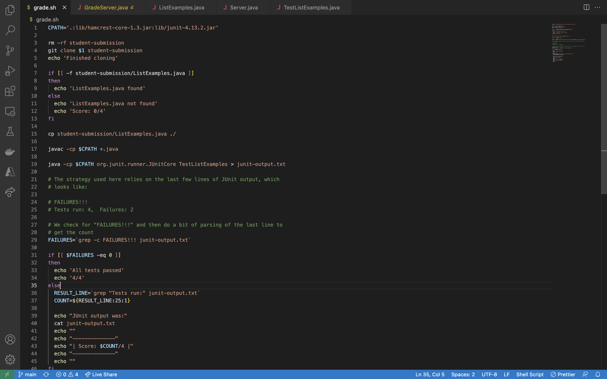
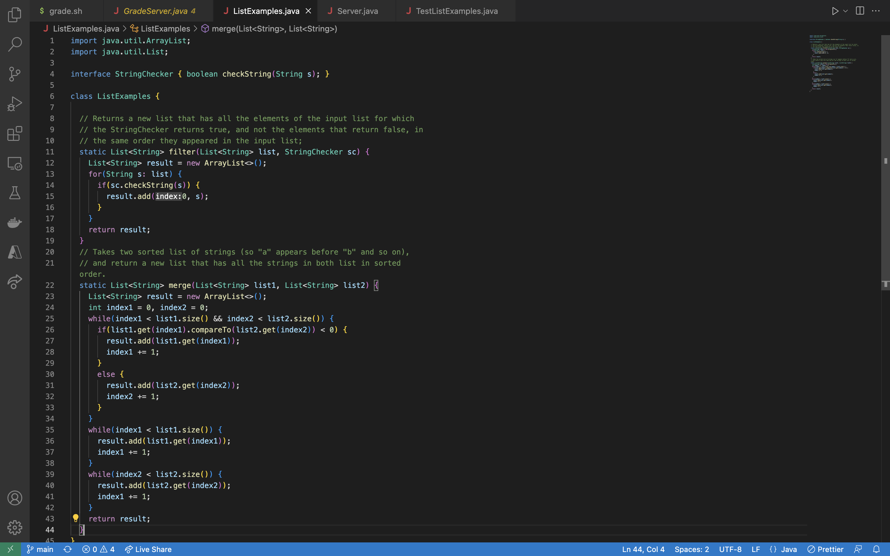
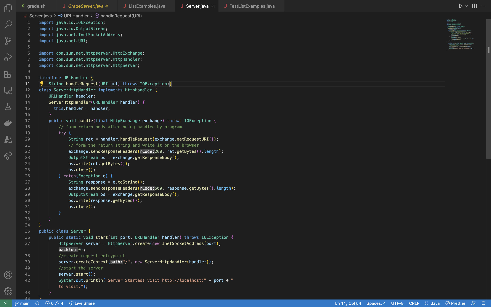
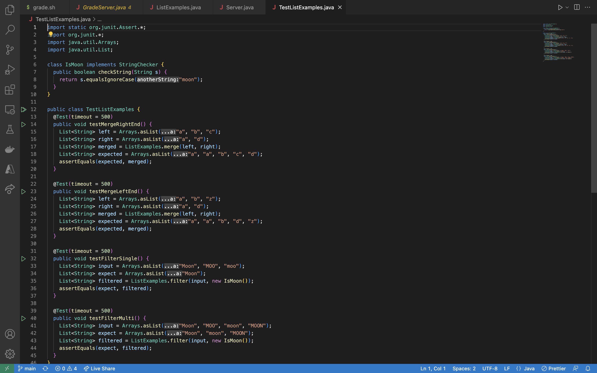
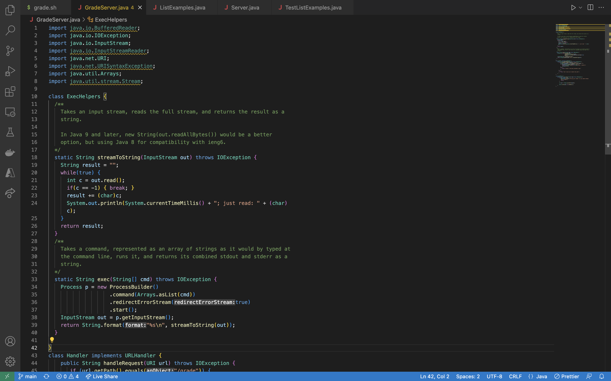
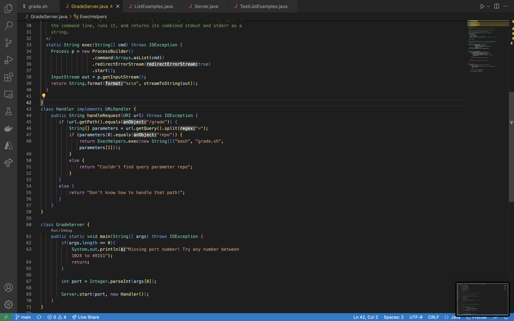

# Lab Report 5

Part 1
Report on EdStem
Student: This would be the original post made by the student:
**What environment are you using (computer, operating system, web browser, terminal/editor, and so on)?**

I am using MacBook Air on the terminal. 

**Detail the symptom you're seeing. Be specific; include both what you're seeing and what you expected to see instead. Screenshots are great, copy-pasted terminal output is also great. Avoid saying “it doesn't work”.**

I am currently getting an initializationError that is caused by java.lang.ClassNotFoundException. 

This is how it looks on my end:

**Detail the failure-inducing input and context. That might mean any or all of the command you're running, a test case, command-line arguments, working directory, even the last few commands you ran. Do your best to provide as much context as you can.**

The failure inducing input is: bash grade.sh https://github.com/ucsd-cse15l-f22/list-methods-lab3

As for context, I have made a grading script that takes in a specific list-method-lab3 and a java file within and checks if the code is up to standard. 
However, in this case the file that needs to be read can't be read because the code couldn't find the class. I am in this directory:

/Users/shreyanagunuri/Downloads/list-examples-grader-main 2

Response from TA:
TA: I think you are going in the right direction when it comes to understanding that the root issue is the class not being found and looking at the working directory. Take a look at 
where exactly this error is being thrown and what is the recurring theme for the failure inducing lines. Sometimes this large errors are caused by the smallest of mistakes! In addition, understand 
where your code should be at certain points. Should the script be looking in a certain folder for a specific file?

Student Response:
Student: Thanks for the feedback! Before I thought that there was something wrong with the java file I was working with but there is a class in there. 
I took a look at where exactly the error is being thrown and I think it is from line 17 where it asks for the CPATH. Thus, I took a look at that and at first glance
it looked accurate. However, I noticed that my code was looking for the lib folder outside of where the user was currently at. More specifically, I had written ..: but I needed to write .: for the code 
to start at where the user is at which is the proper directory to look for the lib folder instead of something outside of that. After running it, my code worked and reflected the proper test cases!

Information on Set Up:
The file and directory structure for this program is particularly simple because there is only one directory inside the main directory List-Examples-Grader-Main 2 which is the lib folder
with the tester files (junit and hamcrest) in them. All other files are outside the lib folder and have no particular structure. For the contents of each file before fixing the bug, here
are screenshots of each java file. 

The full command line (or lines) you ran to trigger the bug was:
`bash grade.sh https://github.com/ucsd-cse15l-f22/list-methods-lab3`
And to fix the bug I did this: 
This: `CPATH='..:lib/hamcrest-core-1.3.jar:lib/junit-4.13.2.jar'` to `CPATH='.:lib/hamcrest-core-1.3.jar:lib/junit-4.13.2.jar'`

Part 2
In a couple of sentences, describe something you learned from your lab experience in the second half of this quarter that you didn’t know before. 
It could be a technical topic we addressed specifically, something cool you found out on your own building on labs, something you learned from a tutor or classmate, and so on. 
It doesn’t have to be specifically related to a lab writeup, we just want to hear about cool things you learned!

One thing that I learned in my lab experience was how to make a bash script. Before this class, I didn't even know what a bash script was and now I know how to use one to run my java files. 
I found it super useful to be able to run several pieces of project at once. I could totally see how I can be applied to the real world and thus I will make sure to remember these concepts to 
become a more efficient coder in the future. 

